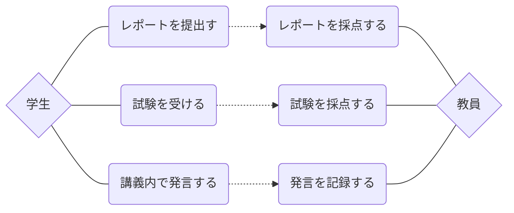
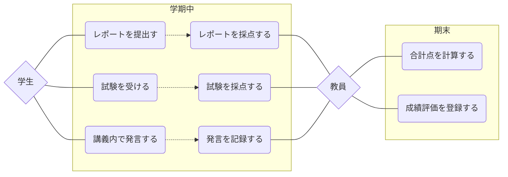
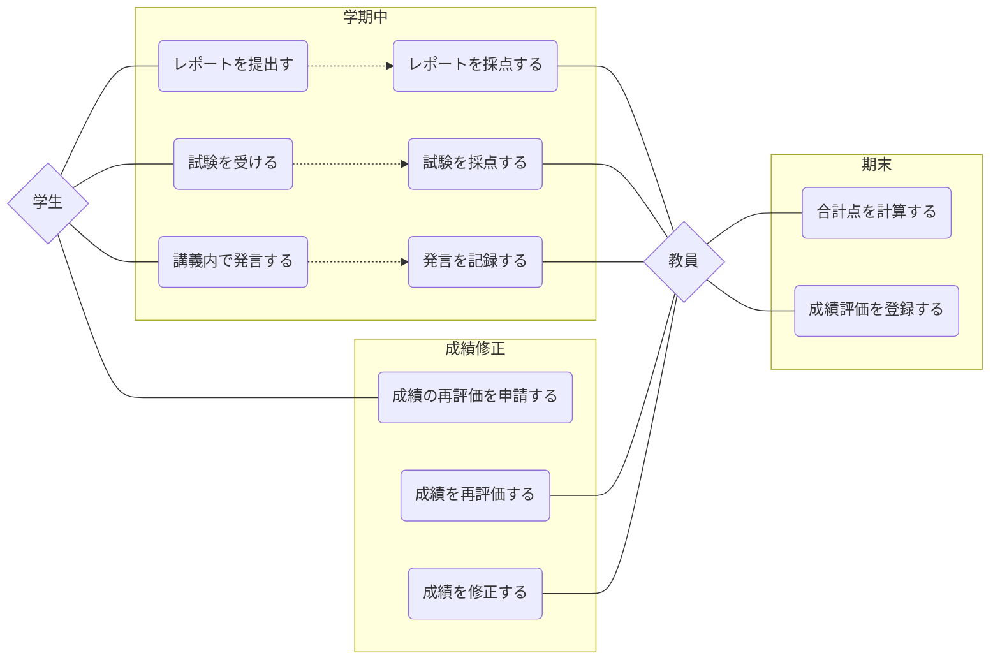

# 演習1

```mermaid
flowchart LR

s{学生}
t{教員}

i1(レポートを提出す)-.->o1(レポートを採点する)
i2(試験を受ける)-.->o2(試験を採点する)
i3(講義内で発言する)-.->o3(発言を記録する)

s---i1 & i2 & i3
o1 & o2 & o3---t
```
# 演習2

```mermaid
flowchart LR

s{学生}
t{教員}

i1(レポートを提出す)-.->o1(レポートを採点する)
i2(試験を受ける)-.->o2(試験を採点する)
i3(講義内で発言する)-.->o3(発言を記録する)

end1(合計点を計算する)
end2(成績評価を登録する)
t---end1
t---end2
s---i1 & i2 & i3
o1 & o2 & o3---t

subgraph　学期中
i1
i2
i3
o1
o2
o3
end

subgraph　期末
end1
end2
end


```
# 演習3

```mermaid
flowchart LR

s{学生}
t{教員}

i1(レポートを提出す)-.->o1(レポートを採点する)
i2(試験を受ける)-.->o2(試験を採点する)
i3(講義内で発言する)-.->o3(発言を記録する)

end1(合計点を計算する)
end2(成績評価を登録する)
t---end1
t---end2
s---i1 & i2 & i3
o1 & o2 & o3---t

subgraph　学期中
i1
i2
i3
o1
o2
o3
end

subgraph　期末
end1
end2
end

k1(成績の再評価を申請する)
k2(成績を再評価する)
k3(成績を修正する)

subgraph 成績修正
k1
k2
k3
end

s---k1
k2 & k3---t

```
